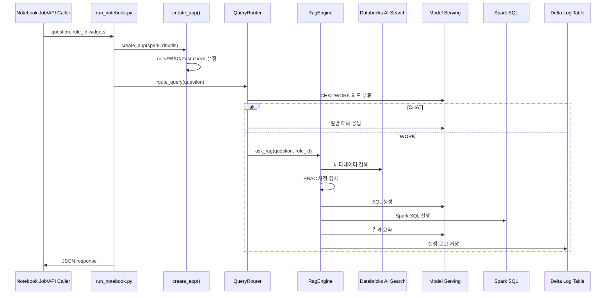

# RBAC RAG SQL Chatbot

Databricks 노트북에서 실행하던 RBAC 기반 RAG SQL 질의 로직을 Python 패키지 형태로 분리한 프로젝트입니다.

현재 코드는 기존 Databricks 노트북 실행 경로를 유지하면서, Jobs API 기반 폴링을 대체할 FastAPI + SSE API 서버 로직을 제공합니다. 배포 기준 실행은 루트 프로젝트 `C:\project3`의 `app.main:app` 단일 서버이며, 이 패키지는 해당 서버에서 import되어 Databricks SQL Connector, Databricks Model Serving, Databricks AI Search(Vector Search), Unity Catalog의 `cos_adb` 카탈로그를 직접 호출합니다.

## 현재 상태

- 실행 진입점: `run_notebook.py`
- 코어 패키지: `rbac_rag/`
- 기존 실행 방식: Databricks 노트북에서 `spark`와 `dbutils`를 주입받아 실행
- 신규 실행 방식: 루트 통합 FastAPI 서버에서 Databricks SQL Connector와 SDK로 직접 호출
- 스트리밍 방식: `POST /v1/chat/stream` SSE
- 주요 외부 의존성:
  - Databricks Workspace SDK
  - Databricks Model Serving endpoint
  - Databricks AI Search / Vector Search index
  - Spark SQL / Unity Catalog
  - `cos_adb` 카탈로그의 governance/search/silver 테이블

## 모듈 구조

| 파일 | 역할 |
| --- | --- |
| `run_notebook.py` | Databricks 노트북용 진입점. 앱 생성 후 결과를 notebook exit JSON으로 반환 |
| `rbac_rag/app.py` | 앱 조립. 위젯 생성, role/RBAC/Post-check 설정, 엔진과 라우터 생성 |
| `rbac_rag/router.py` | `/chat`, `/work`, `/clear` 처리 및 CHAT/WORK 의도 분류 |
| `rbac_rag/engine.py` | WORK 질의 핵심 플로우. RBAC 검사, 메타데이터 검색, SQL 생성/실행, Post-check, 요약, 로그 저장 |
| `rbac_rag/llm.py` | Databricks Model Serving과 AI Search 호출 |
| `rbac_rag/rbac.py` | role 기반 허용 도메인 계산 및 Databricks widget 처리 |
| `rbac_rag/mappings.py` | 도메인별 허용 테이블 목록과 `table_id -> FQN` 매핑 생성 |
| `rbac_rag/logging_utils.py` | RAG SQL 실행 로그 Delta table 저장 |
| `rbac_rag/prompts.py` | SQL 생성, 요약, Post-check, intent 분류 프롬프트 |
| `rbac_rag/settings.py` | 기본 모델명, 인덱스명, 카탈로그명, 로그 테이블명 |
| `rbac_rag/sql_client.py` | Databricks SQL Connector 기반 SQL Warehouse adapter |
| `rbac_rag/audit.py` | SQL Connector 기반 감사 로그 저장 |
| `rbac_rag/sql_validator.py` | 생성 SQL SELECT/allowlist/LIMIT 검증 |
| `rbac_rag/api_service.py` | FastAPI와 RAG 코어 사이의 API service |
| `api/main.py` | standalone FastAPI app. 현재는 legacy/reference 경로이며 배포 entrypoint는 루트 `app.main:app` |

## 현재 질의 흐름



## Databricks 테이블/리소스 계약

현재 코드는 아래 리소스가 존재한다고 가정합니다.

| 리소스 | 용도 |
| --- | --- |
| `cos_adb.search.metadata_chunks_index` | 질문과 관련된 테이블 메타데이터 검색 |
| `cos_adb.search.metadata_chunks` | 벡터 인덱스 원천 테이블로 추정 |
| `cos_adb.search.llm_table_context` | `table_id`, `layer`, `domain` 컨텍스트 매핑 |
| `cos_adb.governance.access_policies` | `role_id`별 접근 가능한 시스템 목록 |
| `cos_adb.silver.roles` | role 목록 |
| `cos_adb.governance.rag_sql_query_logs` | RAG SQL 질의 감사 로그 |
| Databricks Model Serving endpoint | SQL 생성, 요약, intent 분류, Post-check |

## 주요 설정

기본값은 `rbac_rag/settings.py`의 `RagSettings`에 있습니다.

| 설정 | 기본값 |
| --- | --- |
| `llm_model` | `databricks-qwen3-next-80b-a3b-instruct` |
| `embedding_model` | `databricks-qwen3-embedding-0-6b` |
| `vs_endpoint_name` | `cos-rag-endpoint` |
| `vs_index_name` | `cos_adb.search.metadata_chunks_index` |
| `vs_source_table` | `cos_adb.search.metadata_chunks` |
| `catalog` | `cos_adb` |
| `log_table` | `cos_adb.governance.rag_sql_query_logs` |
| `top_k_default` | `5` |

## 통합 FastAPI 실행

배포/로컬 UI 테스트 기준 실행은 루트 프로젝트에서 서버 하나만 실행합니다.

```powershell
cd C:\project3
python -m pip install -r requirements.txt
uvicorn app.main:app --host 127.0.0.1 --port 3000
```

브라우저:

- `http://127.0.0.1:3000`
- `http://127.0.0.1:3000/admin`

Health check:

```powershell
Invoke-RestMethod http://127.0.0.1:3000/health
```

`api/main.py`를 `8000` 포트로 띄우는 방식은 standalone API 확인용으로만 남겨둡니다.

## 패키지 단독 FastAPI 확인

환경 변수 파일을 준비합니다.

```powershell
copy .env.example .env
```

필수 값:

- `DATABRICKS_HOST`
- `DATABRICKS_SERVER_HOSTNAME`
- `DATABRICKS_WAREHOUSE_ID` or `DATABRICKS_HTTP_PATH`
- `DATABRICKS_CLIENT_ID`
- `DATABRICKS_CLIENT_SECRET`

Databricks Apps에서는 `app.yaml`의 `valueFrom: sql-warehouse`가 `DATABRICKS_WAREHOUSE_ID`를 주입하고, 코드는 이를 `/sql/1.0/warehouses/{warehouse_id}` HTTP path로 변환합니다. 로컬 개발에서는 `DATABRICKS_TOKEN` PAT fallback도 사용할 수 있지만, Databricks Apps 운영 배포에서는 앱 런타임이 주입하는 OAuth credential을 우선 사용합니다. PAT, OAuth secret, `.env` 실제 값은 GitHub에 올리지 않습니다.

standalone 서버 실행:

```powershell
python -m venv .venv
.\.venv\Scripts\Activate.ps1
python -m pip install -r requirements.txt
uvicorn api.main:app --host 127.0.0.1 --port 8000 --reload
```

Health check:

```powershell
Invoke-RestMethod http://127.0.0.1:8000/health
```

`.env` 확인 시 토큰이나 OAuth secret을 터미널에 그대로 출력하지 마세요. 대신 마스킹 확인 스크립트를 사용합니다.

```powershell
python scripts/check_env.py --file .env
```

동기 JSON 호출:

```powershell
Invoke-RestMethod `
  -Method Post `
  -Uri "http://127.0.0.1:8000/v1/chat" `
  -ContentType "application/json" `
  -Body '{"question":"지난 분기 품질 이슈 요약해줘","role_id":"GENERAL_EMPLOYEE","mode":"auto"}'
```

SSE 호출은 `POST /v1/chat/stream`을 사용합니다. 이벤트는 `accepted`, `intent`, `rbac`, `retrieval`, `sql_generation`, `sql_validation`, `sql_execution`, `post_check`, `summarization`, `audit`, `final` 순서로 전달될 수 있습니다.

## 로컬 테스트 방향

현재 상태에서는 Databricks 런타임 없이 end-to-end 실행이 되지 않습니다. 로컬에서 테스트하려면 다음 둘 중 하나가 필요합니다.

1. Databricks에 실제로 연결하는 통합 테스트
   - Databricks 인증 환경 변수 또는 CLI profile 필요
   - SQL Warehouse 또는 Databricks Connect 필요
   - Model Serving endpoint와 AI Search index 접근 권한 필요

2. Fake/Mock adapter 기반 단위 테스트
   - LLM, Search, SQL 실행, RBAC 테이블 조회를 fake 객체로 대체
   - 라우터, RBAC 차단, SQL 재시도, 응답 포맷을 로컬에서 검증

자세한 절차는 `docs/LOCAL_DEVELOPMENT.md`를 참고하세요.

## role_id 처리

초기 코드에는 `role_id`가 SQL 문자열에 직접 삽입되는 부분이 있었지만, 현재는 다음 두 단계로 방어합니다.

- `validate_role_id()`로 빈 값, 비정상 문자, 존재하지 않는 role을 거절
- Databricks SQL named parameter marker(`:role_id`)로 값을 바인딩

현재 위치:

- `rbac_rag/rbac.py`
- `rbac_rag/app.py`
- `rbac_rag/engine.py`

API 서버 전환 후에는 추가로 `role_id`를 사용자가 직접 고르게 두지 말고, 로그인 사용자/토큰 claim/server-side session에서 결정하는 구조로 바꾸는 것이 좋습니다.

현재 v1 API는 개발 편의상 JSON body의 `role_id`를 받습니다. 서버는 `cos_adb.silver.roles` allowlist로 검증하지만, 운영 전환 전에는 인증 기반 role 결정으로 변경해야 합니다.
