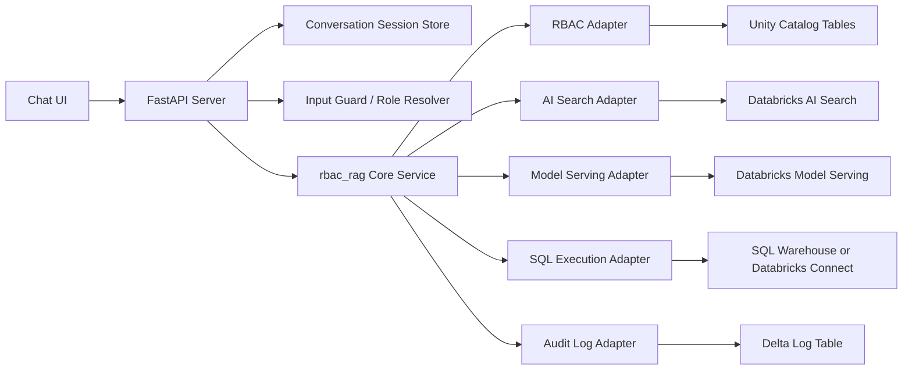

# 실시간 챗봇 전환 아키텍처 계획

## 배경

기존 구조는 Databricks 노트북을 Job으로 실행하고, 외부 호출자가 Job 상태를 폴링한 뒤 결과를 받는 방식입니다. 이 방식은 배치성 작업에는 적합하지만, 챗봇처럼 사용자가 즉시 반응을 기대하는 인터랙션에는 맞지 않습니다.

목표는 다음과 같습니다.

- Job 실행/폴링 제거
- HTTP 요청에 즉시 반응하는 API 계층 추가
- 필요하면 스트리밍으로 진행 상태 또는 답변 전달
- 기존 RBAC/RAG/SQL 생성 로직은 최대한 재사용
- Databricks의 Unity Catalog, AI Search, Model Serving, SQL compute는 계속 활용

## 결론: API 서버를 두는 것이 맞는가?

네. 실시간 챗봇으로 전환하려면 API 서버를 따로 두는 것이 맞습니다.

다만 "어디에 둔다"는 선택지가 있습니다.

| 선택지 | 설명 | 장점 | 단점 | 추천도 |
| --- | --- | --- | --- | --- |
| 로컬/외부 FastAPI 서버 | 별도 VM, 컨테이너, 사내 서버, Cloud Run/App Service 등에 FastAPI 배포 | 일반적인 웹/챗봇 구조, SSE/WebSocket 구현 쉬움, 프론트 연동 쉬움 | Databricks 인증/네트워크/시크릿 관리 필요 | 높음 |
| Databricks Apps | Databricks 안에서 웹/API 앱 실행 | 별도 인프라 부담 적음, Unity Catalog/SQL/OAuth 연동 장점 | 제품 제약과 배포 방식 확인 필요 | 높음 |
| Model Serving custom model | RAG chain 전체를 serving endpoint로 패키징 | 실시간 추론 endpoint로 관리 가능 | 일반 API 서버보다 UI/세션/스트리밍 제어가 제한적일 수 있음 | 중간 |
| 기존 Jobs API 유지 | 노트북 Job 실행 후 폴링 | 현재 코드 변경 적음 | 챗봇 UX에 부적합 | 낮음 |

1차 개발은 로컬 FastAPI 서버로 진행하고, 배포 대상은 두 가지 중 하나로 결정하는 것을 권장합니다.

- 프론트/API까지 Databricks 내부에서 운영하려면 Databricks Apps
- 기존 서비스 인프라나 웹 프론트가 있다면 외부 FastAPI 컨테이너

## 권장 목표 아키텍처



## 필요한 코드 분리

현재 코드는 Databricks 노트북 런타임에 강하게 결합되어 있습니다.

### 현재 결합 지점

| 결합 지점 | 현재 위치 | 문제 |
| --- | --- | --- |
| `spark` 직접 사용 | `engine.py`, `mappings.py`, `rbac.py`, `logging_utils.py` | 로컬 API 서버에서 바로 실행하기 어려움 |
| `dbutils.widgets` 직접 사용 | `app.py`, `runner.py`, `rbac.py` | HTTP request 입력과 맞지 않음 |
| `display()` 직접 호출 | `engine.py` | API 서버 환경에서는 불필요하거나 오류 가능 |
| Databricks SDK 직접 생성 | `llm.py` | 테스트 시 fake/mock 주입이 어려움 |
| 로그 저장 직접 수행 | `engine.py` -> `logging_utils.py` | API 실패/권한 실패/감사 정책을 분리하기 어려움 |

### 목표 분리

| 계층 | 책임 |
| --- | --- |
| API layer | HTTP 요청/응답, 인증, role 추출, SSE/WebSocket |
| Application service | CHAT/WORK 라우팅, conversation memory, request orchestration |
| Domain core | RBAC 판단, RAG 흐름, 응답 포맷 |
| Adapter layer | Databricks SQL, AI Search, Model Serving, Audit Log 구현 |
| Test doubles | 로컬 단위 테스트용 fake LLM/Search/SQL/RBAC |

## API endpoint 초안

### `POST /v1/chat`

일반 JSON 응답용입니다.

```json
{
  "question": "지난 분기 품질 이슈가 가장 많았던 제품은?",
  "role_id": "GENERAL_EMPLOYEE",
  "mode": "auto",
  "rbac_enabled": true,
  "post_check": true
}
```

응답:

```json
{
  "request_id": "...",
  "mode": "WORK",
  "answer": "...",
  "blocked": false,
  "sources": {
    "tables": ["cos_adb.silver.events"]
  },
  "checks": {
    "rbac_enabled": true,
    "pre_check": "PASS",
    "post_check": "PASS"
  }
}
```

### `GET /v1/chat/stream`

챗봇 UI용 SSE endpoint입니다.

이벤트 예시:

```text
event: status
data: {"step":"intent","message":"질문 유형을 분류하고 있습니다."}

event: status
data: {"step":"retrieval","message":"관련 메타데이터를 검색하고 있습니다."}

event: final
data: {"answer":"...", "request_id":"...", "sources":{"tables":["..."]}}
```

초기에는 LLM token-by-token 스트리밍보다 "단계별 상태 스트리밍 + 최종 답변"을 먼저 구현하는 것이 현실적입니다. 현재 `DatabricksLLM.llm_call()`이 완성된 문자열을 반환하는 구조이기 때문입니다.

## Databricks 연결 선택

### SQL 실행

우선순위:

1. Databricks SQL Connector for Python
   - API 서버에서 SQL Warehouse로 쿼리 실행
   - Python DB API 스타일
   - native parameterized query를 사용할 수 있어 보안상 유리

2. Databricks SDK Statement Execution API
   - HTTP 기반 statement 실행
   - 비동기 실행과 polling 개념이 있으므로 짧은 SQL에 대해서는 `wait_timeout` 설계가 중요

3. Databricks Connect
   - 로컬 Python에서 Spark API를 원격 Databricks compute에 연결
   - 기존 `spark.sql(...)` 코드를 가장 적게 바꿀 수 있음
   - API 서버 장기 운영에는 SQL Warehouse 방식이 더 단순할 수 있음

### AI Search

현재 `WorkspaceClient().vector_search_indexes.query_index(...)`를 사용합니다. 최신 제품명은 Databricks AI Search이며, 로컬/서버에서는 인증 정보를 명시적으로 관리해야 합니다.

### LLM 호출

현재 `WorkspaceClient().serving_endpoints.query(...)`를 사용합니다. API 서버에서도 이 구조는 유지할 수 있습니다. 다만 응답 스트리밍이 필요하면 SDK/endpoint가 제공하는 스트리밍 방식 또는 OpenAI-compatible endpoint 사용 가능 여부를 별도로 확인해야 합니다.

## 보안 체크리스트

### 1. `role_id` 처리

초기 코드에는 `role_id`가 SQL 문자열에 직접 삽입되는 부분이 있었습니다.

```python
# rbac_rag/rbac.py
def get_allowed_domains(spark: Any, role_id: str) -> list[str]:
    rows = spark.sql(
        f"""
        SELECT DISTINCT system_name
        FROM cos_adb.governance.access_policies
        WHERE role_id = '{role_id}'
        """
    ).collect()
```

현재 코드는 아래 방식으로 수정되어 있습니다.

```python
WHERE role_id = :role_id
```

그리고 `validate_role_id()`로 빈 값, 비정상 문자, 존재하지 않는 role을 거절합니다.

API 서버 전환 후 추가 대응 방향:

- API 계층에서 `role_id`를 로그인 사용자/토큰 claim/server-side session에서 결정
- 사용자가 임의로 `role_id`를 보내는 구조 제거
- 테스트/관리자 모드에서만 `role_id` override 허용
- SQL Connector를 쓸 경우 native parameterized query 사용
- Spark SQL을 유지할 경우 현재처럼 named parameter marker와 role allowlist 검증 유지

### 2. LLM 생성 SQL 방어

현재 프롬프트로 허용 테이블을 제한하고, post-check를 수행하지만 LLM 출력은 신뢰하면 안 됩니다.

추가 권장:

- SQL parser로 `FROM`/`JOIN` 테이블 추출
- 허용 테이블 외 참조 시 실행 전 차단
- `SELECT`만 허용
- `INSERT`, `UPDATE`, `DELETE`, `MERGE`, `CREATE`, `DROP`, `ALTER`, `COPY`, `CALL` 차단
- `LIMIT` 강제
- 실행 timeout 설정

### 3. 감사 로그

현재 로그는 `cos_adb.governance.rag_sql_query_logs`에 저장됩니다.

API 서버 전환 후 추가하면 좋은 필드:

- `session_id`
- `client_request_id`
- `auth_user_id`
- `source_ip` 또는 client metadata
- `intent_mode`
- `retrieved_context_ids`
- `blocked_stage`

## 단계별 전환 계획

### Phase 1. 문서화와 현재 코드 안정화

- README와 구조 문서 작성
- 현재 노트북 실행 경로 유지
- `role_id` 입력 검증 추가
- `display()` 호출 제거 또는 notebook 전용 옵션으로 분리
- SQL 실행 전 allowlist validator 추가

### Phase 2. 로컬 테스트 가능 구조 만들기

- `LLMClient`, `SearchClient`, `SQLExecutor`, `RBACRepository`, `AuditLogger` 인터페이스 도입
- Fake adapter로 단위 테스트 작성
- `QueryRouter`와 `RagEngine`을 Databricks 없이 테스트 가능하게 분리
- `pytest` 기반 테스트 추가

### Phase 3. FastAPI 서버 추가

- `POST /v1/chat` 구현 완료
- `POST /v1/chat/stream` 구현 완료
- request/response Pydantic schema 구현 완료
- 로컬 `.env` 기반 설정 구현 완료
- request timeout, error mapping, logging middleware는 운영 전 보강 필요

### Phase 4. Databricks 통합 실행

- Databricks SQL Warehouse 또는 Databricks Connect 중 하나 선택
- Model Serving endpoint 통합
- AI Search index 통합
- 실제 `cos_adb` 카탈로그 기반 smoke test

### Phase 5. 배포

- 외부 FastAPI 컨테이너 또는 Databricks Apps 중 선택
- service principal 기반 인증
- 시크릿 관리
- health check와 observability 추가
- staging/prod 설정 분리

## 추천 작업 순서

1. API 인증 기반 role 결정 구조 추가
2. Databricks OAuth M2M 또는 service principal 인증 적용
3. Dockerfile 또는 Databricks Apps 배포 파일 추가
4. 프론트엔드 fetch streaming 연동
5. 운영 모니터링과 timeout/retry 정책 추가

## 참고 공식 문서

- Databricks Apps: https://docs.databricks.com/aws/en/dev-tools/databricks-apps/
- Databricks Apps 배포: https://docs.databricks.com/aws/en/dev-tools/databricks-apps/deploy
- Databricks Model Serving: https://docs.databricks.com/aws/en/machine-learning/model-serving/
- Databricks AI Search query: https://docs.databricks.com/aws/en/ai-search/query-ai-search
- Databricks SQL Connector for Python: https://docs.databricks.com/aws/en/dev-tools/python-sql-connector
- Databricks Statement Execution API: https://docs.databricks.com/api/workspace/statementexecution
